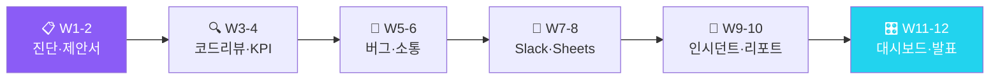

<div align="center">

# 💼 IT서비스 AX 마스터클래스

### "AI로 제안서부터 인시던트 대응까지 설계하는 12주 IT AX 자동화"

**제안서·코드리뷰·KPI·인시던트 — IT 팀 데이터로 직접 검증**

[](https://github.com/Reasonofmoon/hexa-6)
[](https://github.com/Reasonofmoon/hexa-6/tree/main/notebooks)
[](https://github.com/Reasonofmoon/hexa-6)
[](https://aistudio.google.com/)
[](LICENSE)

> **"제안서 작성, 코드 리뷰 코멘트, 장애 보고서... 개발자의 30%가 비생산적 문서 작업이다." 이 과정이 끝나면 자동화됩니다.**

[🚀 W1 바로 시작](https://colab.research.google.com/github/Reasonofmoon/hexa-6/blob/main/notebooks/W01_it_diagnosis.ipynb) · [📂 전체 노트북](notebooks/) · [🔧 CLI 스크립트](scripts/) · [🐛 이슈](../../issues)

</div>

---

## 🧠 Philosophy — "왜 IT/소프트웨어 AX인가"

기존 AI 교육의 문제: **이론만 있고 현장 데이터가 없다**.

| 기준 | 기존 AI 교육 | IT서비스 AX 마스터클래스 |
|------|-------------|---|
| 데이터 | 가상의 샘플 데이터 | **IT/소프트웨어 현장 CSV** |
| 결과물 | 모델 정확도 숫자 | **경영진 보고서 + 자동화 파이프라인** |
| 난이도 | Python 필수 | **Colab 실행만으로 완성** |
| 기간 | 3개월+ 이론 | **W1부터 당일 실전 결과** |
| 연결성 | 개별 실습 | **W1→W12 자동화 파이프라인** |



---

## ⚙️ 12주 커리큘럼

### Layer 1 · Foundation (W1~W4) — AI 기초 도구화

> **Wow**: 맞춤 제안서 초안 **5분** 만에 생성 → 영업 대응 속도 10배

| 주차 | 주제 | 핵심 출력물 | Colab |
|----|------|------------|-------|
| **W1** | IT AX 자가진단 | 10항목 레이더 · IT 팀 AI 전환 로드맵 | [](https://colab.research.google.com/github/Reasonofmoon/hexa-6/blob/main/notebooks/W01_it_diagnosis.ipynb) |
| **W2** | 제안서 자동 생성 | 맞춤 제안서 초안 · 경쟁사 차별화 포인트 | [](https://colab.research.google.com/github/Reasonofmoon/hexa-6/blob/main/notebooks/W02_it_proposal.ipynb) |
| **W3** | AI 코드 리뷰 | 보안·성능·가독성 3축 AI 코멘트 생성 | [](https://colab.research.google.com/github/Reasonofmoon/hexa-6/blob/main/notebooks/W03_it_code_review.ipynb) |
| **W4** | 프로젝트 KPI 분석 | 일정·품질·비용 KPI 차트 · 리스크 분류 | [](https://colab.research.google.com/github/Reasonofmoon/hexa-6/blob/main/notebooks/W04_it_project_kpi.ipynb) |

### Layer 2 · Analytics (W5~W8) — 데이터 기반 의사결정

> **Wow**: 코드 붙여넣기 → AI 보안·성능 리뷰 **즉시** 코멘트 생성

| 주차 | 주제 | 핵심 출력물 | Colab |
|----|------|------------|-------|
| **W5** | 버그 리포트 자동화 | 재현단계·영향도·우선순위 자동 포맷화 | [](https://colab.research.google.com/github/Reasonofmoon/hexa-6/blob/main/notebooks/W05_it_bug_report.ipynb) |
| **W6** | 고객 커뮤니케이션 | 장애 안내·업데이트 노트·감사 메일 3종 | [](https://colab.research.google.com/github/Reasonofmoon/hexa-6/blob/main/notebooks/W06_it_customer_comm.ipynb) |
| **W7** | Slack 이슈 알림 | KPI 임계 경보 · Webhook 자동 발송 | [](https://colab.research.google.com/github/Reasonofmoon/hexa-6/blob/main/notebooks/W07_it_slack_issue_alert.ipynb) |
| **W8** | KPI Google Sheets | 팀 KPI Sheets 업로드 · CSV fallback | [](https://colab.research.google.com/github/Reasonofmoon/hexa-6/blob/main/notebooks/W08_it_kpi_sheets.ipynb) |

### Layer 3 · Intelligence (W9~W12) — 자동화 운영 시스템

> **Wow**: 인시던트 발생 → Slack 경보 + 원인분석 + 고객 공지 **원클릭**

| 주차 | 주제 | 핵심 출력물 | Colab |
|----|------|------------|-------|
| **W9** | 인시던트 이상 감지 | MTTR·장애빈도 3σ 감지 · 경보메시지 | [](https://colab.research.google.com/github/Reasonofmoon/hexa-6/blob/main/notebooks/W09_it_incident_anomaly.ipynb) |
| **W10** | 고객 리포트 자동화 | 월간 SLA·업타임·주요이슈 리포트 | [](https://colab.research.google.com/github/Reasonofmoon/hexa-6/blob/main/notebooks/W10_it_customer_report.ipynb) |
| **W11** | IT 종합 대시보드 | KPI·버그·인시던트 4패널 · AI 분석 | [](https://colab.research.google.com/github/Reasonofmoon/hexa-6/blob/main/notebooks/W11_it_dashboard.ipynb) |
| **W12** | 12주 성과 Cockpit | IT팀 KPI 비교 · 경영진 보고서 자동화 | [](https://colab.research.google.com/github/Reasonofmoon/hexa-6/blob/main/notebooks/W12_it_cockpit.ipynb) |

---

## 🎯 수준별 활용 가이드

### 🟢 Starter — "5분 안에 첫 AI 결과"
> AX 진단점수 10~24점 · 코딩 경험 없음

1. [W1 노트북](https://colab.research.google.com/github/Reasonofmoon/hexa-6/blob/main/notebooks/W01_it_diagnosis.ipynb) 클릭 → Google Colab에서 열기
2. `GEMINI_API_KEY` 입력 ([발급](https://aistudio.google.com/apikey))
3. 서비스명·팀규모 입력 → IT AX 진단 레이더 차트
4. `Ctrl+F9` (전체 실행) → 결과 자동 다운로드

### 🔵 Professional — "실제 데이터로 실전 분석"
> AX 진단점수 25~39점 · 기초 Excel 가능

1. `shared/it_kpi_sample.csv` 구조 확인
2. 코드 붙여넣기 → 보안·성능 AI 리뷰 즉시 생성
3. W7~W8에서 Slack/Sheets 연결
4. W9~W10으로 이상감지·소통 자동화 구축

### 🟣 Enterprise — "12주 파이프라인 & 팀 표준화"
> AX 진단점수 40~50점 · 자동화 확장 목표

1. W11 대시보드 → KPI·버그·인시던트 통합 모니터링
2. W12 보고서를 정기 자동화 스케줄로 전환
3. 다른 hexa 시리즈와 교차 벤치마킹

---

## 🔧 확장 우선순위

| 우선순위 | 커스터마이징 | 난이도 | 영향 범위 |
|----------|--------------|--------|----------|
| **1st** | 팀 정보 입력 | ⭐ | 서비스명·규모 |
| **2nd** | KPI CSV 실제 데이터 | ⭐⭐ | 분석 전체 |
| **3rd** | Slack Webhook 연결 | ⭐⭐ | 실시간 알림 |
| **4th** | Sheets KPI 연동 | ⭐⭐⭐ | 경영 대시보드 |
| **5th** | W10 고객 리포트 자동화 | ⭐⭐⭐ | SLA 고객 발송 |

---

## 📂 프로젝트 구조

```
hexa-6/
├── notebooks/          ← 12주 Colab 실습 노트북 (W01~W12)
│   ├── W01_it_diagnosis.ipynb                        # W1: IT AX 자가진단
│   ├── W02_it_proposal.ipynb                         # W2: 제안서 자동 생성
│   ├── W03_it_code_review.ipynb                      # W3: AI 코드 리뷰
│   ├── W04_it_project_kpi.ipynb                      # W4: 프로젝트 KPI 분석
│   ├── W05_it_bug_report.ipynb                       # W5: 버그 리포트 자동화
│   ├── W06_it_customer_comm.ipynb                    # W6: 고객 커뮤니케이션
│   ├── W07_it_slack_issue_alert.ipynb                # W7: Slack 이슈 알림
│   ├── W08_it_kpi_sheets.ipynb                       # W8: KPI Google Sheets
│   ├── W09_it_incident_anomaly.ipynb                 # W9: 인시던트 이상 감지
│   ├── W10_it_customer_report.ipynb                  # W10: 고객 리포트 자동화
│   ├── W11_it_dashboard.ipynb                        # W11: IT 종합 대시보드
│   ├── W12_it_cockpit.ipynb                          # W12: 12주 성과 Cockpit
├── scripts/            ← CLI Python 스크립트 (코드리뷰 · KPI분석 · 인시던트알림)
├── shared/             ← 실습 데이터 (it_kpi_sample.csv)
└── labs/               ← 보조 실습 가이드
```

---

## 🚀 빠른 시작

```bash
git clone https://github.com/Reasonofmoon/hexa-6.git && cd hexa-6
pip install google-generativeai pandas matplotlib numpy  # 로컬 실행 시
```

[](https://colab.research.google.com/github/Reasonofmoon/hexa-6/blob/main/notebooks/W01_it_diagnosis.ipynb)
[](https://colab.research.google.com/github/Reasonofmoon/hexa-6/blob/main/notebooks/W02_it_proposal.ipynb)
[](https://colab.research.google.com/github/Reasonofmoon/hexa-6/blob/main/notebooks/W03_it_code_review.ipynb)
[](https://colab.research.google.com/github/Reasonofmoon/hexa-6/blob/main/notebooks/W04_it_project_kpi.ipynb)

---

## 🔗 전체 AX 시리즈 (hexa-1~6)

| 레포 | 섹터 | 핵심 AI 자동화 | 링크 |
|------|------|--------------|------|
| **hexa-1** | 🏭 제조업 | 불량분류·OEE·예지보전 | [→](https://github.com/Reasonofmoon/hexa-1) |
| **hexa-2** | 🍽️ F&B | 리뷰분석·메뉴카피·재고예측 | [→](https://github.com/Reasonofmoon/hexa-2) |
| **hexa-3** | 🛒 소매/이커머스 | 상품카피·CRM·SEO분석 | [→](https://github.com/Reasonofmoon/hexa-3) |
| **hexa-4** | 📚 교육/학원 | 교안자동화·성적분석·챗봇 | [→](https://github.com/Reasonofmoon/hexa-4) |
| **hexa-5** | 🏗️ 건설/시공 | 계약서·공정KPI·안전점검 | [→](https://github.com/Reasonofmoon/hexa-5) |
| **hexa-6** (현재) | 💼 IT서비스 | 제안서·코드리뷰·인시던트 | — |

---

## 🌐 다국어 지원

| 항목 | 현황 |
|------|------|
| 노트북 UI | 🇰🇷 한국어 |
| 스크립트 출력 | 한국어 (컬럼 한/영 자동감지) |
| 샘플 데이터 | 한국어 컬럼명 |
| README | 한국어 / English (예정) |

---

*AX Consulting Curriculum © 2026 | Powered by Google Gemini 2.0 Flash*
